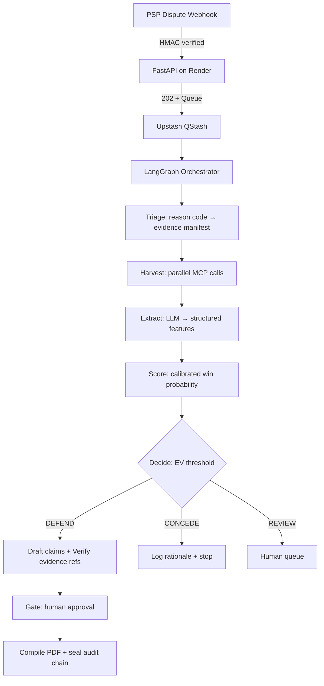

# AutoDefend AI

**The problem:** When a cardholder disputes a charge, the merchant has ~7–14 days to assemble evidence scattered across their payment gateway, shipping carrier, and CRM — or lose the revenue *plus* a fee. Most merchants either forfeit winnable disputes or waste fees defending unwinnable ones.

**The solution:** AutoDefend ingests the dispute webhook, autonomously harvests evidence from all four systems via MCP, computes whether defending is *economically* worthwhile using a calibrated expected-value threshold, generates a fully grounded representment package with every claim tied to verified evidence, and pauses for human approval before anything is filed.

---

## How It Works



**Why the queue?** Free compute spins down. A webhook times out before cold start finishes. QStash retries with backoff — the worker *can* be asleep. Scale-to-zero becomes a cost win, not a correctness bug.

---

## The Decision Science

Most systems use a flat confidence cutoff. That's wrong. Defending a $50 dispute with a $40 fee needs 44% win probability. A $500 dispute needs 7.4%. **The break-even is per-case: `p* = F / (A + F)`**

We calibrate raw model probabilities (isotonic regression) so the threshold means what it says. The tabular baseline (XGBoost over the same features) is the real benchmark — if it matches the agent on classification, the agent's value is *autonomous retrieval + grounded generation*, not the decision itself. We report that honestly.

---

## Evidence, Verified

Every claim in the output document carries an evidence reference (e.g., `logistics.pod.delivered_at`). A deterministic verifier resolves each reference against harvested evidence. **Unresolved claims are dropped, not hallucinated.** Drop rate > policy threshold → human review.

---

## Tech Stack (Free Tier)

| Layer | Choice | Constraint |
|-------|--------|------------|
| Compute | Render Web Service | 512 MB, scales to zero |
| Queue | Upstash QStash | ~1K msgs/day |
| Cache/Limiter | Upstash Redis | 500K cmds/mo |
| Database | Neon Postgres | ~0.5 GB, branches |
| Primary LLM | Gemini `gemini-3.6-flash` | ~1.5K req/day |
| Fallback LLM | Groq (OpenAI-compat) | High daily ceiling |
| Tracing | Langfuse Cloud | Generous |

**All config is env-driven. No hardcoded model IDs, rate limits, or thresholds.**

---

## Project Structure

```
autodefend/
├── app/              # FastAPI: webhook, internal, console, health
├── graph/            # LangGraph: state, nodes, policy, checkpoints
├── mcp_servers/      # 4 servers: logistics, gateway, crm, core
├── llm/              # Gateway: providers, limiter, cache, ledger
├── ml/               # Features, calibration, tabular baseline
├── evidence/         # Claims model + deterministic verifier
├── render/           # Templates → PDF (WeasyPrint)
├── eval/             # Synthetic data, 5 arms, metrics with CIs
├── db/               # SQLAlchemy + Alembic
├── tests/            # Unit, contract, integration
└── infra/            # Dockerfile, render.yaml, GitHub Actions
```

---

## Commands

```bash
make setup          # install deps, provision local env
make db.migrate     # run migrations
make db.seed        # load mock backing data
make dev            # run locally with reload
make test.unit      # pure logic tests
make test.contract  # MCP tool contracts
make test.integration  # full graph against seeded data
make eval.generate  # build synthetic dataset + splits
make eval.run       # execute all 5 evaluation arms
make eval.report    # render metrics doc (auto-updates this table)
make ml.calibrate   # fit + persist calibrator
make lint && make typecheck
```

---

## Evaluation Results (Dev Split)

| Arm | Precision | Recall | F1 | Net Revenue | Cost/Dispute |
|-----|-----------|--------|-----|-------------|--------------|
| B0: Majority | — | — | — | — | — |
| B1: Rule Engine | — | — | — | — | — |
| B2: Tabular | — | — | — | — | — |
| B3: LLM No Tools | — | — | — | — | — |
| B4: Full Agent | — | — | — | — | — |

*Auto-generated by `make eval.report`. See [eval-report.md](docs/eval-report.md) for intervals, calibration curves, ablations, and error taxonomy.*

---

## Documentation

- [Threat Model](docs/threat-model.md) — data flow, redaction, free-tier data policies
- [Evaluation Report](docs/eval-report.md) — full metrics, variance runs, honest findings
- [ADRs](docs/adr/) — queue ingestion, checkpointing, EV thresholding, deterministic verification

---

## Live Demo

- **Service**: `https://autodefend.onrender.com`
- **Health**: `GET /healthz` | **Readiness**: `GET /readyz`
- **Console**: `https://autodefend.onrender.com/console` — dispute queue, evidence view, approve/reject, eval dashboard

---

## Non-Goals (Deliberate Scope Cuts)

- ❌ Direct filing to card networks — we produce a submission-ready package, stop at a stubbed PSP client
- ❌ Visa reason codes only (10.x, 13.x) — no Mastercard/RuPay claims
- ❌ Fraud detection at authorisation — post-hoc adjudication only
- ❌ Multi-tenant billing, onboarding, real payment integration

---

## License

MIT